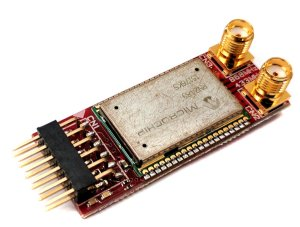
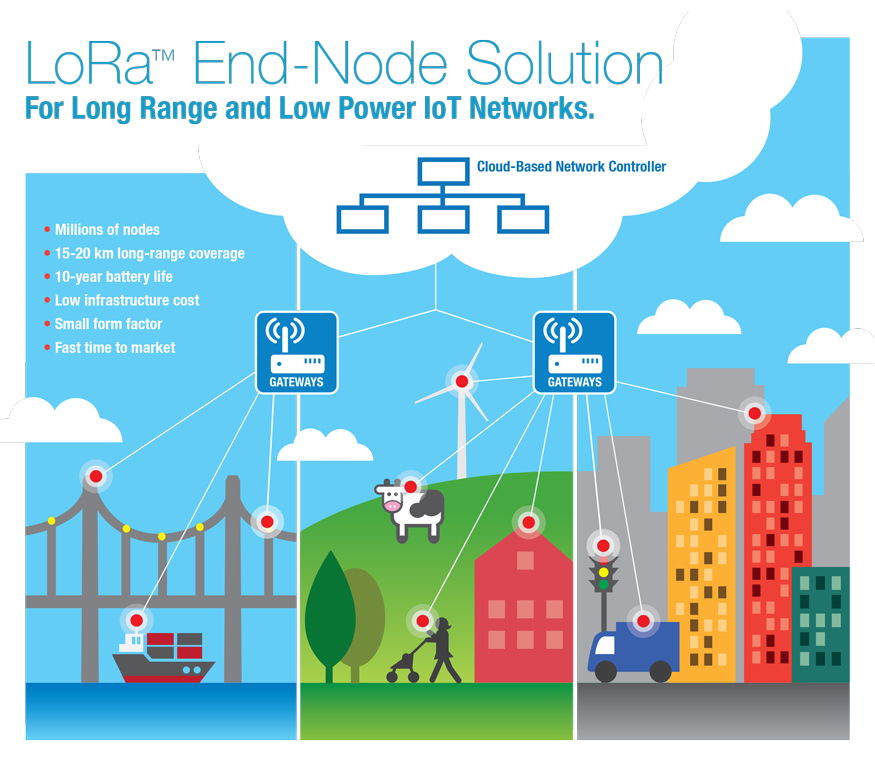

.. RN2483_Silica documentation master file

Welcome to PMOD-Lora documentation!
===================================

:Version: 1.00A
:Copyright: (C)2016 Avnet Memec Silica company
:Date: 23 Mar 2016
:Reference name: BAEPMOD-COM-003-A01

Microchip’s Long Range Low Power End Node solution
--------------------------------------------------

*PMOD-Lora*

.. index:: index

**INTRODUCTION**
----------------

Microchip’s Long Range Low Power End Node solution

With the growing Internet of Things, Microchip has a LoRa® Technology wireless solution to address increasing demands on end-devices for long range connectivity, low power for battery operation, and low infrastructure cost for volume deployment.

Microchip’s LoRa Technology solution is ready to run out-of-the box and with the complete LoRaWAN™ Protocol and certifications in place, it reduces time to market and saves development costs. 

The RN2483 is a LoRa™-integrated modem with a range of more than 15 km (suburban), low power enabling a battery life greater than 10 years and the ability to connect millions of wireless sensor nodes to LoRa gateways and IoT-connected Cloud Servers. This robust system is due to LoRa’s unique spread-spectrum based modulation that is capable of demodulation 20 dB below the noise level. This enables high sensitivity for ultra-long range, improved network efficiency and eliminates interference. The RN2483 modem operates over the 433 and 868 MHz license-free Industry Scientific and Medical (ISM) frequency bands and serves as the end-device in the LoRa network infrastructure.

The RN2483 is a fully-certified 433/868 MHz module based on wireless LoRa® technology.

The module's embedded LoRaWAN™ Class A protocol enables seamless connectivity to any LoRaWAN compliant network infrastructure, whether public or privately deployed.  The module is specifically designed for ease of use, which shortens development time and speeds time to market.  LoRa technology is ideal for battery-operated sensors and low power applications such as IoT, M2M, Smart City, Sensor networks, Industrial automation, and more.

Features:

- On-board LoRaWAN™ Class A protocol stack 
- ASCII command interface over UART 
- Compact form factor 17.8 x 26.7 x 3 mm 
- Castellated SMT pads for easy and reliable PCB mounting 
- Device Firmware Upgrade (DFU) over UART 
- 14 GPIO for control, status, and ADC 
- Highly integrated module with MCU, crystal, EUI-64 Node Identity Serial EEPROM, Radio transceiver with analog front end, and matching circuitry 
- Environmentally friendly, RoHS compliant 
- European R&TTE Directive Assessed Radio Module

Developement tools
******************

Firmware developed using:
NXP Codewarrior. For installation and configuration of the project, follow instruction inside :ref:`quick`

Document references
*******************

The board reference documentation is available on the `architech-board <http://architechboards.org>`_ website. 

Contents:

.. toctree::
   :maxdepth: 2

   qs
   develop
   hw

